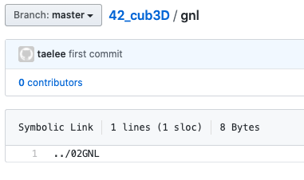

### 1. ex00) sybolic link, hard link

```shell
-rw-r--r--  2 taelee  staff  16 May  3 19:07 hardlink
-rw-r--r--  2 taelee  staff  16 May  3 19:07 original
-rw-r--r--  1 taelee  staff  13 May  3 19:07 original_s
lrwxr-xr-x  1 taelee  staff  10 May  3 19:08 symboliclink -> original_s
```

- 하드 링크시 ls -l 했을때 두번째 숫자가 2로 바뀐것 이외에는 둘이 연결됐다는것이 표시가 안됨(검색해보니 이 숫자가 하드링크의 갯수라고 함)

- 심볼릭 링크시 화살표로 어떤파일을 향하고 있는지 표시가 됨. 하지만 두번째 숫자가 1로 그대로임 그리고 맨처음에 l(link인듯)이 표시가 됨

- 둘다 원본이 수정되면 링크도 수정되고, 링크가 수정되면 원본도 수정됨
- 하드링크는 원본이 지워져도 링크는 살아있지만 심볼릭링크의 경우 원본이 사라지면
  `symboliclink: No such file or directory` 이런 문구가 뜸
- 하드링크에서 원본이 지워진 경우 링크본의 숫자가 1로 바뀜(검색해보니 이 숫자가 하드링크의 갯수라고 함)
- 당연하지만, 링크본이 지워졌을경우 둘다 원본에는 아무 변화가 없음


### 2. ex01) 용량비교

```shell
total 24
-rw-r--r--  1 taelee  staff    20 May  3 20:05 hardlink
-rw-r--r--  1 taelee  staff  3091 May  3 20:06 original
-rw-r--r--  1 taelee  staff  3091 May  3 20:06 original_s
lrw-r--r--  1 taelee  staff    10 May  3 20:05 symboliclink -> original_s
```

- 원본을 lorem ipsum 문자열을 넣어서 3091바이트 파일로 만들어 보기도 하고 아예 내용을 다 지워서 용량을 0으로 만들어 보기도 했는데 
  Hard Link는 원본파일크기 
  Symbolic Link는 10Byte로 일정함

- Hard Link와 원본 파일은 용량이 같이 움직임

### 3. ex02) 용량비교 2

- 심볼릭 링크의 용량은 원본파일의 파일명의 용량과 같은게 아닌가 싶음.

  ```shell
  -rw-r--r--  1 taelee  staff  27813 May  3 21:01 original
  lrwxr-xr-x  1 taelee  staff      8 May  3 21:12 symboliclink -> original
  ```

- ex01에서 원본 파일명이 original_s일때는 10바이트 original일때는 8바이트임.


실험끝

ln 옵션 관련 설명 된 사이트

https://webdir.tistory.com/148


### 4. Symbolic link를 github에 푸쉬했을 때

###  

이런식으로 파일이 저장되지 않고 경로만 나옴. 다른 곳에서 다운받으면 제대로 실행이 안 될것으로 예상